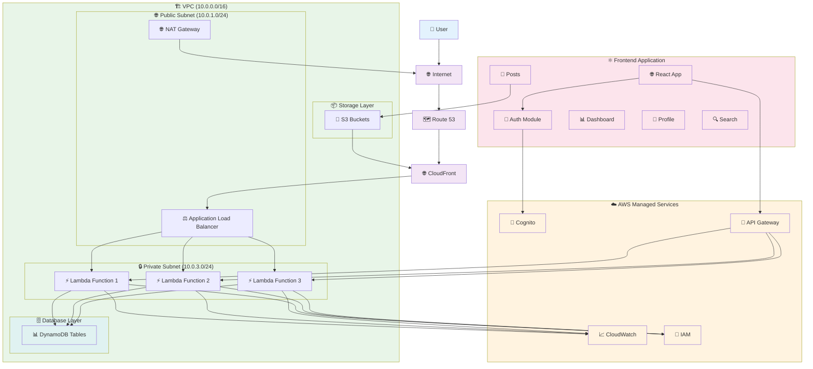

# ProfessionalNet - Clean Architecture Diagram

## 🎨 **Clean AWS Architecture Diagram**

This is the final, clean architecture diagram for ProfessionalNet that we'll implement step by step.

---

## 📊 **Complete Architecture Diagram**

---

## 🎯 **What This Diagram Represents**

### **Complete ProfessionalNet Infrastructure:**
- **Frontend**: React application with all features
- **Backend**: Serverless Lambda functions
- **Database**: DynamoDB for data storage
- **Storage**: S3 for file uploads
- **CDN**: CloudFront for global performance
- **Authentication**: Cognito for user management
- **Monitoring**: CloudWatch for observability
- **Security**: IAM for access control
- **Networking**: VPC with proper subnets

### **Production-Ready Features:**
- ✅ **Auto-scaling** Lambda functions
- ✅ **High availability** with multi-AZ
- ✅ **Security** with VPC isolation
- ✅ **Global performance** with CloudFront
- ✅ **Monitoring** and alerting
- ✅ **Cost optimization** with serverless

---

**This is our target architecture - we'll build this step by step!** 🚀 