# ProfessionalNet - Clean Architecture Diagram

## 🎨 **Clean AWS Architecture Diagram**

This is the final, clean architecture diagram for ProfessionalNet that we'll implement step by step.

---

## 📊 **Complete Architecture Diagram**

```mermaid
graph TB
    %% User Layer
    User[👤 User]
    
    %% Internet Layer
    Internet[🌐 Internet]
    
    %% DNS & CDN Layer
    Route53[🗺️ Route 53]
    CloudFront[🌐 CloudFront]
    
    %% VPC Container
    subgraph VPC["🏗️ VPC (10.0.0.0/16)"]
        subgraph PublicSubnet["🌐 Public Subnet (10.0.1.0/24)"]
            ALB["⚖️ Application Load Balancer"]
            NAT["🌐 NAT Gateway"]
        end
        
        subgraph PrivateSubnet["🔒 Private Subnet (10.0.3.0/24)"]
            Lambda1["⚡ Lambda Function 1"]
            Lambda2["⚡ Lambda Function 2"]
            Lambda3["⚡ Lambda Function 3"]
        end
        
        subgraph DatabaseSubnet["🗄️ Database Layer"]
            DynamoDB["📊 DynamoDB Tables"]
        end
        
        subgraph StorageSubnet["📦 Storage Layer"]
            S3["💾 S3 Buckets"]
        end
    end
    
    %% AWS Managed Services (Outside VPC)
    subgraph ManagedServices["☁️ AWS Managed Services"]
        Cognito["👥 Cognito"]
        APIGateway["🚪 API Gateway"]
        CloudWatch["📈 CloudWatch"]
        IAM["🔐 IAM"]
    end
    
    %% Frontend Layer
    subgraph Frontend["⚛️ Frontend Application"]
        React["🌐 React App"]
        Auth["🔐 Auth Module"]
        Dashboard["📊 Dashboard"]
        Posts["📝 Posts"]
        Profile["👤 Profile"]
        Search["🔍 Search"]
    end
    
    %% Connections - User Flow
    User --> Internet
    Internet --> Route53
    Route53 --> CloudFront
    CloudFront --> ALB
    
    %% Frontend to Backend
    React --> Auth
    Auth --> Cognito
    React --> APIGateway
    
    %% API Gateway to Lambda
    APIGateway --> Lambda1
    APIGateway --> Lambda2
    APIGateway --> Lambda3
    
    %% Lambda to Database
    Lambda1 --> DynamoDB
    Lambda2 --> DynamoDB
    Lambda3 --> DynamoDB
    
    %% File Upload Flow
    Posts --> S3
    S3 --> CloudFront
    
    %% Monitoring & Security
    Lambda1 --> CloudWatch
    Lambda2 --> CloudWatch
    Lambda3 --> CloudWatch
    
    Lambda1 --> IAM
    Lambda2 --> IAM
    Lambda3 --> IAM
    
    %% Network Flow
    ALB --> Lambda1
    ALB --> Lambda2
    ALB --> Lambda3
    NAT --> Internet
    
    %% Styling
    classDef userLayer fill:#e3f2fd
    classDef networkLayer fill:#f3e5f5
    classDef vpcLayer fill:#e8f5e8
    classDef managedLayer fill:#fff3e0
    classDef frontendLayer fill:#fce4ec
    classDef databaseLayer fill:#e0f2f1
    
    class User userLayer
    class Internet,Route53,CloudFront networkLayer
    class VPC,PublicSubnet,PrivateSubnet,StorageSubnet vpcLayer
    class ManagedServices,Cognito,APIGateway,CloudWatch,IAM managedLayer
    class Frontend,React,Auth,Dashboard,Posts,Profile,Search frontendLayer
    class DatabaseSubnet,DynamoDB databaseLayer
```

---

## 🎯 **What This Diagram Represents**

### **Complete ProfessionalNet Infrastructure:**
- **Frontend**: React application with all features
- **Backend**: Serverless Lambda functions
- **Database**: DynamoDB for data storage
- **Storage**: S3 for file uploads
- **CDN**: CloudFront for global performance
- **Authentication**: Cognito for user management
- **Monitoring**: CloudWatch for observability
- **Security**: IAM for access control
- **Networking**: VPC with proper subnets

### **Production-Ready Features:**
- ✅ **Auto-scaling** Lambda functions
- ✅ **High availability** with multi-AZ
- ✅ **Security** with VPC isolation
- ✅ **Global performance** with CloudFront
- ✅ **Monitoring** and alerting
- ✅ **Cost optimization** with serverless

---

**This is our target architecture - we'll build this step by step!** 🚀 